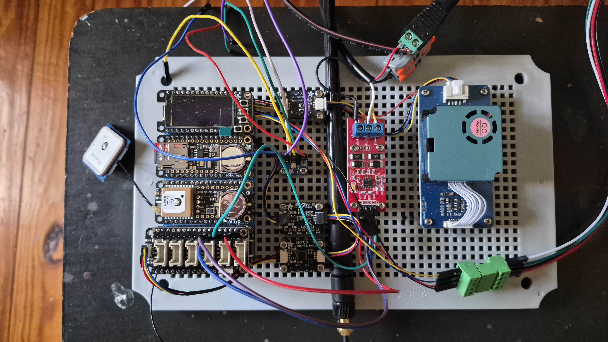

# FeatherWeather

ESP32-based weather station with GPS timestamping, battery-backed RTC, and SD card logging.




## Hardware

### Feather Stack

| Board | Product | Interface | Purpose |
|-------|---------|-----------|---------|
| [Adafruit ESP32 Feather V2 w.FL](https://www.adafruit.com/product/5438) | #5438 | — | Main MCU, WiFi, BT, NeoPixel |
| [Adalogger FeatherWing](https://www.adafruit.com/product/2922) | #2922 | I2C + SPI | PCF8523 RTC + microSD |
| [Ultimate GPS FeatherWing](https://www.adafruit.com/product/3133) | #3133 | UART | PA1616D GPS/GLONASS |
| [FeatherWing OLED 128×64](https://www.adafruit.com/product/4650) | #4650 | I2C (0x3C) | SH1107 display + 3 nav buttons |

### Sensors

| Sensor | Product | Interface | I2C Address | Measures |
|--------|---------|-----------|-------------|---------|
| [Adafruit BMP390](https://www.adafruit.com/product/4816) | #4816 | I2C (STEMMA QT) | 0x77 (0x76 alt) | Pressure, altitude, temperature |
| [Adafruit SHTC3](https://www.adafruit.com/product/4636) | #4636 | I2C (STEMMA QT) | 0x70 (fixed) | Temperature, humidity |
| [Seeed HM3301](https://wiki.seeedstudio.com/Grove-Laser_PM2.5_Sensor-HM3301/) | Grove | I2C (Grove) | 0x40 (fixed) | PM1.0, PM2.5, PM10 air quality |
| [DFRobot SEN0575](https://wiki.dfrobot.com/sen0575/) | SEN0575 | I2C | 0x1D (fixed) | Rainfall (mm), tip count, uptime |
| [DFRobot SEN0482](https://wiki.dfrobot.com/sen0482/) | SEN0482 | RS485 Modbus RTU | 0x02 default ⚠ | Wind direction (degrees + 16-pt) |
| [DFRobot SEN0483](https://wiki.dfrobot.com/sen0483/) | SEN0483 | RS485 Modbus RTU | 0x02 default ⚠ | Wind speed (m/s + Beaufort) |
| [DFRobot SEN0644](https://wiki.dfrobot.com/sen0644/) | SEN0644 | RS485 Modbus RTU | 0x01 default | Illuminance (0-200k Lux, IP68) |
| [Adafruit I2S MEMS Microphone](https://www.adafruit.com/product/3421) | #3421 | I2S | — | Audio (deferred — see notes) |

### Pin Assignments (ESP32 Feather V2)

| Peripheral | Signal | ESP32 Pin |
|-----------|--------|-----------|
| Adalogger RTC (PCF8523) | SDA | 22 |
| Adalogger RTC (PCF8523) | SCL | 20 |
| Adalogger SD Card | SCK | 5 |
| Adalogger SD Card | MOSI | 19 |
| Adalogger SD Card | MISO | 21 |
| Adalogger SD Card | CS | 33 |
| GPS FeatherWing | TX → RX | 7 |
| GPS FeatherWing | RX → TX | 8 |
| Built-in NeoPixel | Data | 0 |
| BMP390 + SHTC3 | SDA/SCL | STEMMA QT |
| RS485 DFR0845 | UART TX (→ module R) | A0 |
| RS485 DFR0845 | UART RX (← module T) | A1 |
| OLED FeatherWing #4650 | Button C — TOP (next page →) | A8 (GPIO15) |
| OLED FeatherWing #4650 | Button B — MIDDLE (force redraw) | A7 (GPIO32) |
| OLED FeatherWing #4650 | Button A — BOTTOM (← prev page) | A6 (GPIO37, input-only) |
| I2S MEMS Mic #3421 | BCLK | D27 (GPIO27) |
| I2S MEMS Mic #3421 | LRCL (WS) | D13 (GPIO13) |
| I2S MEMS Mic #3421 | DOUT | A2 |
| I2S MEMS Mic #3421 | SEL | GND (left channel) |

### I2S MEMS Microphone wiring (#3421)

The breakout has six through-holes. Suggested cable colors:

| Pin (breakout) | Wire color | Connect to |
|----------------|-----------|------------|
| 3V             | red       | 3V on Feather |
| GND            | green     | GND on Feather (the single GND header pin) |
| BCLK           | yellow    | D27 (GPIO27) |
| DOUT           | white     | A2 (GPIO34, input-only) |
| LRCL           | orange    | D13 (GPIO13 — labeled **led** in the pinout PDF; `board.D13` in CircuitPython) |
| SEL            | —         | **Bridge to GND on the breakout PCB** with a short jumper wire (see note below) |

> **GND / SEL note:** The Feather V2 exposes only one GND header pin. Rather than running two ground wires to the board, solder a short wire directly between the `SEL` and `GND` through-holes on the mic breakout. This selects left-channel output and leaves only five wires running to the Feather. Tie `SEL` to `3V` on the breakout instead if you want right-channel output.
>
> **D13 / "led" pin note:** The pinout PDF labels this pin **led** (primary) with GPIO13 as the secondary label. In CircuitPython it is `board.D13` (also `board.LED`). It is the fourth signal pin on the top row: BAT → EN → USB → **led/GPIO13** → 12 → 27 → 33 → 15 → 32 → 14 → SCL → SDA. The red LED is driven by this pin — it will mirror the LRCL signal while audio is running, which is harmless.

### DFR0845 RS485 Adapter wiring

The [DFRobot DFR0845](https://www.dfrobot.com/product-2392.html) replaces the MAX3485. It provides galvanic isolation (3000 VDC), auto-direction control, and an isolated 12V power output for the RS485 sensors. No DE/~RE pin is used.

**Gravity UART connector → ESP32 Feather V2**

| DFR0845 pin | Signal | ESP32 pin |
|-------------|--------|-----------|
| `+` (VCC) | 5V power | **USB** (VBUS, 5V) ⚠ see note |
| `-` (GND) | Ground | **GND** |
| `T` (module TX out) | RS485 → MCU | **A1** (UART RX, GPIO25) |
| `R` (module RX in) | MCU → RS485 | **A0** (UART TX, GPIO26) |

> `T` connects to `A1` and `R` connects to `A0` — the labels are from the module's perspective, so they cross-connect to the ESP32's RX/TX.

> **⚠ Power the DFR0845 from the `USB` pin (5V VBUS), not `3V`.** The module's internal boost converter generates 12V from its UART VCC. Powering it from the `3V` pin overloads the Feather V2's AP2112K LDO (500mA rated), starving the ESP32 and causing brownout/flicker on I2C sensors. The `USB` pin is raw VBUS before the LDO and can supply the extra current. The DFR0845 UART signal lines are 3.3V-logic compatible regardless of VCC.

**RS485 screw terminal**

| Terminal | Connect to |
|----------|-----------|
| `A` | RS485 bus A |
| `B` | RS485 bus B |
| `12V` | Sensor power + wire (≤ 160 mA combined) |
| `GND` | Sensor power − wire (isolated RS485 ground) |

**External 12V supply (12V-IN screw terminal)**

Connect a 12V DC supply here when the three RS485 sensors together draw more than 160 mA. The internal boost converter still generates 12V from USB/UART power even when this supply is off, so **12V will appear on the `12V-IN` terminals as backfeed** any time the ESP32 is powered. Power the external supply on before or at the same time as the ESP32.

**settings.toml**

```toml
RS485_AUTO_DIRECTION = true   # required — DFR0845 handles direction internally
```

D12 (GPIO12) must not be connected to the adapter.

### SEN0575 Rain Gauge wiring (STEMMA QT ↔ DFRobot Gravity JST)

The DFRobot SEN0575 board ships with a 4-pin JST-PH "Gravity" connector whose
**power/ground colors are inverted** from the standard Adafruit STEMMA QT
convention. The on-board silkscreen labels the JST pins `V G D C` (VCC, GND,
SDA, SCL), but the matching DFRobot pigtail uses **black for V** and **red
for G** — the opposite of what STEMMA QT cables do. To bridge a STEMMA QT
cable from the Feather to the DFRobot JST, swap the red/black wires:

| STEMMA QT (Feather end) | DFRobot JST (sensor end) | Signal |
|-------------------------|--------------------------|--------|
| red                     | **black** (V)            | 3.3 V  |
| black                   | **red**   (G)            | GND    |
| blue                    | green     (D)            | SDA    |
| yellow                  | white     (C)            | SCL    |

> **Double-check before powering on.** Reversing 3V3/GND on the SEN0575 will
> damage the on-board MCU. The wire colors above are correct only if your
> DFRobot pigtail follows the V=black / G=red convention printed on this
> particular SEN0575 board — verify with a multimeter (continuity from the JST
> pin under the `V` silkscreen back to the cable conductor) before plugging
> into the Feather.

Set the SEN0575 DIP switch to **I2C** (not UART) before connecting; the sensor
appears at I2C address `0x1D` and is verified by `diagnostic.py` and read on
every cycle by `code.py`.

### Hardware Notes

- **GPS FeatherWing**: requires UART — works with ESP32 Feather V2. Does not work with Feather 328p, ESP8266, or nRF52832.
- **Adalogger SD**: uses SPI bus; CS is the dedicated SD_CS pin on the wing.
- **Adalogger RTC**: PCF8523 I2C address `0x68`. Requires CR1220 coin cell for battery backup.
- **GPS RTC**: PA1616D has its own built-in RTC; used to sync the PCF8523 on first GPS fix.
- **BMP390**: STEMMA QT I2C, default address `0x77`. Provides pressure (±3 Pa / ±0.25 m), temperature (±0.5 °C).
- **SHTC3**: STEMMA QT I2C, fixed address `0x70`. Provides temperature (±0.2 °C) and humidity (±2 %RH). Chain via QT cable from BMP390 or directly from Feather V2 STEMMA QT port.
- **HM3301**: Grove I2C, fixed address `0x40`. **Must run at ≤ 20 kHz I2C speed.** Allow 30 s warm-up. CRC failures and spurious values are common — the reader retries automatically.
- **RS485 sensors (SEN0482/0483/0644)**: All share one RS485 bus via a [DFRobot DFR0845 Active Isolated RS485-to-UART adapter](https://www.dfrobot.com/product-2392.html). The adapter handles TX/RX direction switching internally — set `RS485_AUTO_DIRECTION = true` in `settings.toml` and do **not** wire D12. UART is on A0 (TX → module R) and A1 (RX ← module T). **Power the DFR0845 `+` pin from the Feather `USB` pin (5V VBUS), not `3V`** — its internal boost converter draws enough current to overload the AP2112K LDO and brownout the board. The RS485 screw terminal provides an isolated 12V/160mA output for sensor power; connect an external 12V supply to the `12V-IN` terminals. **Backfeed warning**: the module's internal boost converter generates 12V from UART VCC and this voltage appears on the `12V-IN` terminals even when the external supply is off — always power the external 12V supply on before or simultaneously with USB power. **SEN0482 and SEN0483 both default to Modbus address 0x02** — use `reader.set_address()` with each sensor connected alone to resolve the conflict before deploying on the shared bus.
- **OLED FeatherWing #4650**: SH1107 128×64 monochrome display on the shared I2C bus at address `0x3C`. Three buttons are stacked vertically on the wing — TOP (C) advances to the next page, MIDDLE (B) forces a redraw, BOTTOM (A) goes back. Board pins are `A8`/`A7`/`A6` (GPIO15/32/37) on the Feather ESP32 V2 — the FeatherWing PCB labels them "5"/"6"/"9" but those Feather header positions map to different GPIO names on ESP32 than on SAMD/RP2040. The display is refreshed automatically after each sensor cycle.
- **I2S MEMS Microphone #3421**: SPH0645LM4H-LB on a 6-pin breakout. Requires `audioi2sin.I2SIn` from [CircuitPython PR #10990](https://github.com/adafruit/circuitpython/pull/10990) (merged 2026-06-03). **Not in stable 10.2.1** — use a **10.3.0-dev main nightly** (2026-06-03 or later) from [circuitpython.org/board/adafruit_feather_esp32_v2](https://circuitpython.org/board/adafruit_feather_esp32_v2/) → **Absolute Newest** until 10.3.0 beta/rc ships. On older firmware, `MicrophoneReader` raises `NotImplementedError` and is silently skipped by `code.py`; the SOUND LEVEL display page shows `---`. Pins: `D27` (BCLK, GPIO27), `D13` (LRCL/WS, GPIO13 — labeled **led** in the pinout PDF, also drives the red LED, harmless during audio), `A2` (DOUT, GPIO34 input-only). `SEL` is bridged to `GND` on the breakout PCB (left channel) — the Feather has only one GND header pin so both grounds are satisfied at the breakout side.
- **SEN0575**: Set DIP switch to I2C position before use. Fixed address `0x1D`. No official CircuitPython library — uses a ported raw I2C driver. Provides cumulative rainfall (mm), raw tip count, and uptime. Rolling 1-24 hour window available via `read_window(hours)`. **Wire colors are inverted** on the DFRobot JST (V=black, G=red) — see [SEN0575 Rain Gauge wiring](#sen0575-rain-gauge-wiring-stemma-qt--dfrobot-gravity-jst) for the STEMMA-QT↔Gravity mapping.
- **I2C address map**: SEN0575 `0x1D`, HM3301 `0x40`, OLED SH1107 `0x3C`, PCF8523 `0x68`, SHTC3 `0x70`, BMP390 `0x77` — no conflicts.
- **Power**: USB-C or LiPoly battery with built-in charging on the Feather V2.

## Setup

### Install dev dependencies

```bash
poetry install
```

### Configure secrets

```bash
cp settings.toml.example settings.toml
# edit settings.toml: WiFi, MQTT, sensor timings, etc.
```

For WiFi-assisted workflows (`circup-install`, `deploy`), set **`ESP32_IP`** to your board's address on the LAN and **`CIRCUITPY_WEB_API_PASSWORD`** to match the CircuitPython WiFi / Web Workflow password you configured on the device (see [CircuitPython workflows](https://docs.circuitpython.org/en/latest/docs/workflows.html)). Empty password skips the `--password` flag for `circup-install`; `deploy` still sends Basic Auth and may fail if the device requires a password.

### Flash CircuitPython firmware

```bash
# Download CircuitPython .bin for ESP32 Feather V2 from circuitpython.org
# Stable 10.2.1 for most sensors; I2S mic needs 10.3.0-dev main nightly (2026-06-03+)
# wget https://downloads.circuitpython.org/bin/adafruit_feather_esp32_v2/en_US/adafruit-circuitpython-adafruit_feather_esp32_v2-en_US-<VER>.bin
# then flash:
poetry run esptool --chip esp32 --port /dev/ttyUSB0 write_flash -z 0x0 adafruit-circuitpython-adafruit_feather_esp32_v2-en_US-*.bin
```

### Install CircuitPython libraries on device

**WiFi (`circup` against the device's Web Workflow)**

After the board has joined Wi‑Fi with Web Workflow enabled, install Adafruit bundles listed in **`pyproject.toml`** using the IP and optional API password from **`settings.toml`**:

```bash
poetry run circup-install
```

This extracts each `adafruit-circuitpython-*` dependency from the locally cached Adafruit CircuitPython Bundle (host-only packages like Blinka are skipped) and uploads them via Web Workflow. Override with **`--host`** / **`--password`** is not wired in this script—it always reads **`ESP32_IP`** and **`CIRCUITPY_WEB_API_PASSWORD`** from `settings.toml`. Use **`--serial`** for USB-serial install via mpremote when WiFi is unavailable.

**USB mass storage**

Alternatively, attach the CIRCUITPY drive and install manually:

```bash
poetry run circup --path /media/$USER/CIRCUITPY install adafruit_gps adafruit_pcf8523 adafruit_sdcard neopixel
```

## Development

### Code Quality

```bash
poetry run lint      # check isort + black + flake8
poetry run format    # auto-fix with isort + black
```

### Testing

```bash
poetry run test      # pytest with coverage → reports/htmlcov/
```

After tests pass locally, **`poetry run deploy`** uploads firmware sources over Wi‑Fi (see Deployment).

### Tool Reference

| Tool | Version | Purpose |
|------|---------|---------|
| `black` | ^24.10 | Code formatting (88 char) |
| `isort` | ^5.13 | Import sorting |
| `flake8` | ^7.1 | Style checking |
| `pylint` | ^3.3 | Static analysis |
| `pytest` | ^8.3 | Test runner |
| `pytest-cov` | ^6.0 | Coverage → `reports/htmlcov/` |
| `esptool` | ^4.7 | Flash ESP32 firmware |
| `circup` | ^2.0 | Manage CircuitPython libs on device |

### Convenience scripts (`pyproject.toml`)

| Entry point | Runs |
|-------------|------|
| `poetry run circup-install` | Reads `pyproject.toml` + `settings.toml`; runs **`circup --host`** (and **`--password`** if set) to install CP libraries |
| `poetry run deploy` | Runs **`pytest`** on `tests/`; on success uploads **`code.py`** and **`src/featherweather/`** → `lib/featherweather/` via HTTP PUT to **`http://<ESP32_IP>/fs/...`** (Web Workflow; uses **`CIRCUITPY_WEB_API_PASSWORD`** for Basic Auth) |

`poetry run deploy --skip-tests` uploads without running tests (use sparingly).

## Deployment

### Deploy over Wi‑Fi (`deploy`)

Requires Web Workflow enabled, **`ESP32_IP`** and **`CIRCUITPY_WEB_API_PASSWORD`** in `settings.toml` (password must match the device if protection is enabled).

```bash
poetry run deploy
```

This runs **`pytest tests/ -v --tb=short`** first (no HTML coverage report; use `poetry run test` for coverage). After a clean run it PUTs **`code.py`** and every **`*.py`** under **`src/featherweather/`** to **`/fs/code.py`** and **`/fs/lib/featherweather/...`** on the board.

### Deploy over USB-serial (`deploy --serial`)

Use when WiFi is unavailable or the device is in a broken state. The Feather ESP32 V2 uses a CH340 USB-to-serial bridge (no native USB), so this is the only USB recovery path — there is no CIRCUITPY mass-storage drive on this board.

```bash
poetry run deploy --serial                       # default port /dev/ttyACM0
poetry run deploy --serial --port /dev/ttyACM1   # non-default port
poetry run deploy --serial --diagnostic          # diagnostic.py as code.py
poetry run deploy --serial --sysmon              # sysmon.py as code.py
```

Uses **`mpremote`** (already a dev dependency) to push `settings.toml`, `boot.py`, `code.py`, and the `featherweather` package over the serial port.

For an interactive REPL session over the same port:

```bash
poetry run mpremote connect /dev/ttyACM0 repl    # Ctrl+X to exit
```

### Deploy via USB mass storage (ESP32-S2/S3 only)

The Feather ESP32 V2 does **not** expose a CIRCUITPY drive — this section applies only if you migrate to a board with native USB.

```bash
# Copy the package to the device library folder
cp -r src/featherweather /media/$USER/CIRCUITPY/lib/

# Copy the main entry point to the device root
cp code.py /media/$USER/CIRCUITPY/code.py

# Copy your configured secrets file
cp settings.toml /media/$USER/CIRCUITPY/settings.toml
```

### Scheduling

`code.py` reads all sensors at fixed 5-minute wall-clock boundaries
(`:00`, `:05`, `:10` … `:55`) using the PCF8523 RTC for alignment.
Between readings it sleeps via `asyncio.sleep()`, which allows a
background GPS task to continuously poll NMEA sentences so that GPS
altitude is always fresh when a sensor cycle runs.

The read interval is controlled by `READ_INTERVAL_MINUTES` in `code.py`.

### RS485 address conflict

SEN0482 (wind direction) and SEN0483 (wind speed) both ship with default
Modbus address `0x02`. Before connecting both to the shared RS485 bus,
reprogram one of them with each sensor connected alone:

```python
# One-time setup: reassign SEN0483 to address 0x03
reader = WindSpeedReader(rs485_uart, de_pin, address=0x02)
reader.set_address(0x03)
# Power-cycle the sensor, then update _WIND_SPD_ADDR in code.py to 0x03
```

## Project Structure

```
code.py                 # device entry point → deploy to CIRCUITPY/
src/featherweather/
├── __init__.py         # package root
├── display/            # OLED FeatherWing [4650] - SH1107 128x64 + button nav
├── gps/                # Ultimate GPS FeatherWing [3133] - PA1616D UART
├── rtc/                # Adalogger FeatherWing [2922] - PCF8523 I2C
├── storage/            # Adalogger FeatherWing [2922] - microSD SPI
└── sensors/            # sensor aggregation / coordination
    ├── barometric/     # BMP390 [4816] - pressure + temperature (STEMMA QT I2C)
    ├── temp_humidity/  # SHTC3 [4636] - temperature + humidity (STEMMA QT I2C)
    ├── air_quality/    # HM3301 - PM1.0/PM2.5/PM10 (Grove I2C @ 20 kHz)
    ├── rainfall/       # SEN0575 - tipping bucket rainfall (I2C)
    ├── wind_direction/ # SEN0482 - wind vane 0-360° + 16-pt compass (RS485)
    ├── wind_speed/     # SEN0483 - wind speed m/s + Beaufort (RS485)
    ├── illuminance/    # SEN0644 - 0-200k lux, IP68 waterproof (RS485)
    └── rs485/          # shared Modbus RTU master used by all RS485 sensors
tests/
scripts/
├── circup_install.py   # CP libs from pyproject.toml → circup over Wi‑Fi
├── deploy.py           # test then upload code.py + featherweather via Web Workflow
├── lint.py             # isort + black + flake8 runner
├── read_rs485_sensor.py  # host Modbus sanity check (USB-RS485)
├── set_modbus_address.py
└── test.py             # pytest + coverage runner
settings.toml.example   # WiFi / secrets template (copy → settings.toml)
```
